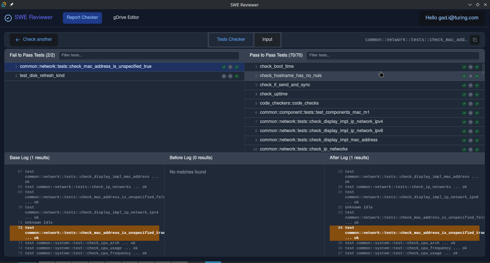

# SWE Reviewer

A Tauri-based desktop application for software engineering review tasks, built with React, TypeScript, and Rust.



## Prerequisites

Before building this project, ensure your system meets the following requirements:

- **Operating System**: Windows 7 or later, macOS Catalina (10.15) or later, or a recent Linux distribution
- **System Dependencies**: Platform-specific packages (see installation steps below)

## Installation & Build Instructions

### 1. Install System Dependencies

#### Windows
- **Microsoft C++ Build Tools**: Download and install [Microsoft C++ Build Tools](https://visualstudio.microsoft.com/visual-cpp-build-tools/). During installation, select the "Desktop development with C++" workload.
- **WebView2 Runtime**: If you're on Windows 10 (version 1803 or later) or Windows 11, WebView2 is likely pre-installed. Otherwise, download and install the [WebView2 Runtime](https://developer.microsoft.com/en-us/microsoft-edge/webview2/).

#### macOS
- **Xcode Command Line Tools**: Open Terminal and run:
  ```bash
  xcode-select --install
  ```

#### Linux (Ubuntu/Debian)
```bash
sudo apt update
sudo apt install libwebkit2gtk-4.1-dev build-essential curl wget file libxdo-dev libssl-dev libayatana-appindicator3-dev librsvg2-dev
```

#### Linux (Fedora/RHEL/CentOS)
```bash
sudo dnf install webkit2gtk4.1-devel openssl-devel gtk3-devel libayatana-appindicator-gtk3-devel librsvg2-devel
```

#### Linux (Arch)
```bash
sudo pacman -S webkit2gtk base-devel curl wget file openssl appmenu-gtk-module gtk3 libappindicator-gtk3 librsvg libxdo
```

### 2. Install Rust

#### Windows
- Download and run the [Rust installer](https://www.rust-lang.org/tools/install)

#### macOS and Linux
```bash
curl --proto '=https' --tlsv1.2 -sSf https://sh.rustup.rs | sh
```

After installation, restart your terminal and verify Rust is installed:
```bash
rustc --version
cargo --version
```

### 3. Install pnpm

#### All Platforms
```bash
npm install -g pnpm
```

Verify installation:
```bash
pnpm --version
```

### 4. Build the Project

1. **Clone and navigate to the project directory**:
   ```bash
   git clone <repository-url>
   cd swe-reviewer
   ```

2. **Install dependencies**:
   ```bash
   pnpm install
   ```

3. **Build the application**:
   ```bash
   cargo tauri build
   ```

   This command will:
   - Compile the Rust backend
   - Build the React frontend
   - Package everything into a distributable binary

### 5. Run the Application

After a successful build, you can find the binary at:

```
src-tauri/target/release/swe-reviewer
```

#### Windows
```cmd
src-tauri\target\release\swe-reviewer.exe
```

#### macOS/Linux
```bash
./src-tauri/target/release/swe-reviewer
```

## Development

For development with hot reload:

```bash
cargo tauri dev
```

This will start the development server with hot reload enabled for both frontend and backend changes.

## Project Structure

- `src/` - React frontend (TypeScript)
- `src-tauri/src/` - Rust backend
- `dist/` - Built frontend assets
- `src-tauri/target/release/` - Final compiled binary

## Troubleshooting

### Common Issues

1. **WebView2 not found (Windows)**: Ensure WebView2 Runtime is installed
2. **WebKit not found (Linux)**: Install the webkit2gtk development packages
3. **Build tools missing (macOS)**: Run `xcode-select --install`
4. **Permission denied (Linux)**: Make sure the binary is executable: `chmod +x src-tauri/target/release/swe-reviewer`

### Cross-Platform Building

Building Windows applications on Linux or macOS is possible but experimental. It requires additional setup including NSIS, LLVM, and cross-compilation tools. Refer to the [Tauri documentation](https://v2.tauri.app/distribute/windows-installer/) for detailed instructions.

## Recommended IDE Setup

- [VS Code](https://code.visualstudio.com/) + [Tauri](https://marketplace.visualstudio.com/items?itemName=tauri-apps.tauri-vscode) + [rust-analyzer](https://marketplace.visualstudio.com/items?itemName=rust-lang.rust-analyzer)
